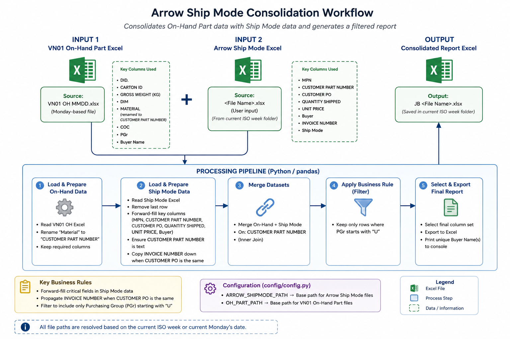
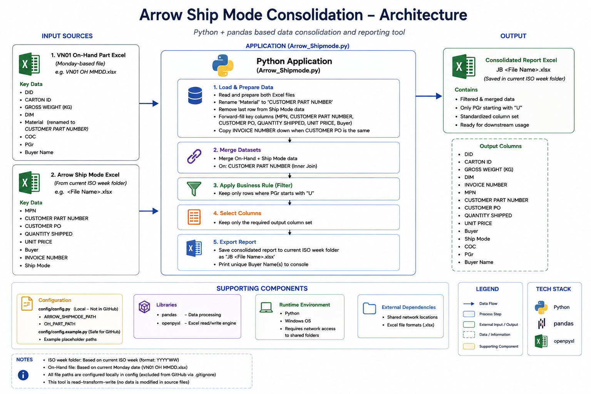

# Arrow Ship Mode & OH Merge Automation

Python automation that combines weekly On-Hand and Arrow Ship Mode Excel data into a consolidated Purchasing report.

## Overview

This project automates a recurring Excel-based reporting workflow used by a Purchasing team.

The automation reads two Excel datasets, prepares the data, applies business rules, matches records using Customer Part Number, filters the required Purchasing Group records, and generates a consolidated Excel report.

## Business Problem

The weekly process involved repetitive Excel preparation, including:

- Filling down repeated values
- Maintaining invoice information
- Matching data between reports
- Filtering required Purchasing Group records
- Preparing the final reporting file

The automation standardizes these steps using Python and pandas.

## Solution

The automation:

1. Determines the current reporting week.
2. Locates the required input files using configured paths.
3. Validates the input files and required columns.
4. Prepares the On-Hand and Arrow Ship Mode datasets.
5. Forward-fills selected Arrow Ship Mode fields.
6. Propagates Invoice Number when consecutive records share the same Customer PO.
7. Normalizes Customer Part Number values.
8. Merges both datasets using Customer Part Number.
9. Filters records where `PGr` starts with `U`.
10. Generates the consolidated Excel report.

## Workflow

## Architecture

The project uses a lightweight Python/pandas architecture designed for a recurring Excel reporting workflow.

## Before & After

Sanitized sample data is provided to demonstrate the transformation without exposing company information.

- **Before:** Separate Arrow Ship Mode and On-Hand datasets requiring manual preparation and matching.
- **After:** A consolidated report containing the required Purchasing and shipment information.

Sample files are available under `docs/examples/`.

## Technologies

- Python
- pandas
- openpyxl
- Microsoft Excel

## Key Features

- Weekly ISO week-based file-path handling
- Input file and column validation
- Excel data processing
- Forward-fill transformation
- Invoice number propagation
- Customer Part Number normalization
- DataFrame merge
- Purchasing Group filtering
- Automated Excel report generation

## Results

The automation standardizes a recurring weekly reporting process and reduces repetitive manual data preparation.

No time-saving percentage is stated because verified measurements are not available.

## My Role

I developed and maintained the automation, translating Purchasing requirements into Python/pandas data-processing rules and maintaining the reporting workflow.

## Limitations

- Depends on the expected structure and column names of the source Excel files.
- File locations are environment-specific.
- The final Arrow Ship Mode row is excluded before processing based on the existing workflow logic.
- The merge does not enforce a uniqueness relationship because the original business requirement does not define one.

## Future Improvements

- Improve handling of non-detail rows in source reports.
- Add more detailed processing feedback.
- Add automated tests using sanitized sample data.

## Disclaimer

This repository contains a sanitized portfolio version. Company-specific files, confidential business data, and internal network locations are excluded.
